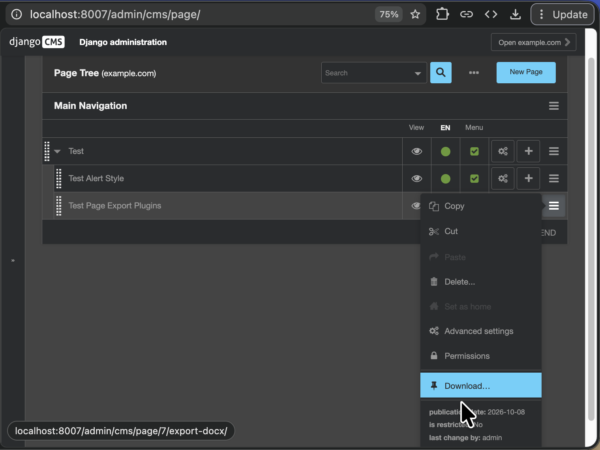
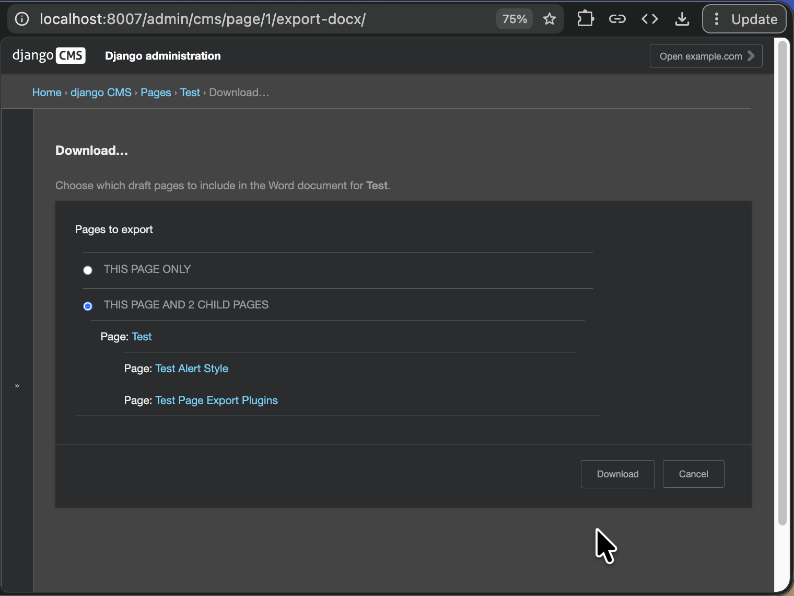
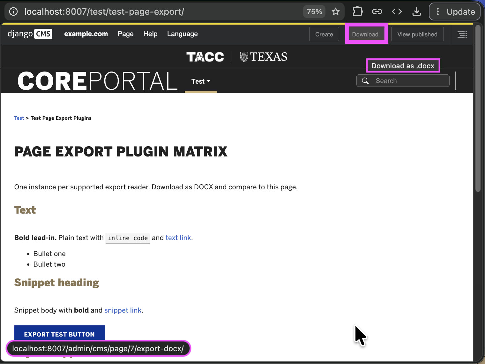
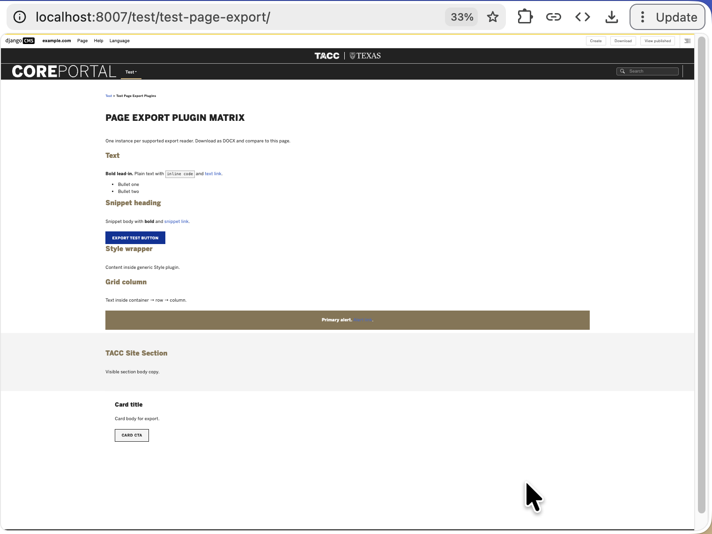
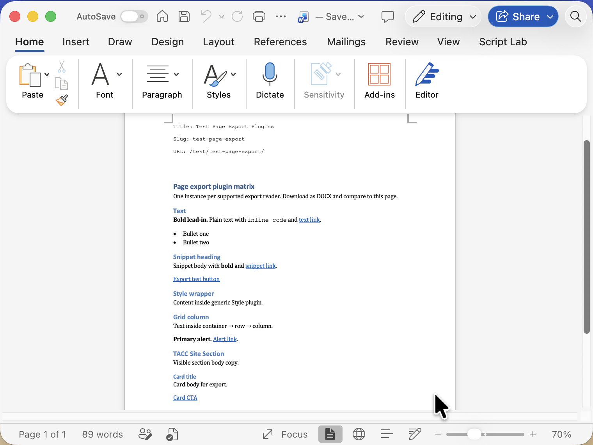

## Texas Advanced Computing Center
# Django CMS App: "Page Export"

This app exports **rendered draft** CMS page content (placeholder plugin tree) to **DOCX**, with optional Google Drive export planned for a later phase.

- __Distribution Name__: `djangocms-tacc-page-export`
- __Package Name__: `djangocms_tacc_page_export`
- __Class Name__: `TaccsitePageExport`
- __App Name__: "Page Export"

See [docs/plan-core-cms-page-export.md](docs/plan-core-cms-page-export.md) for Phase 2 (Google Drive) and long-term scope.

## Quick Start

1. Follow [(wiki) Usage Quick Start](https://github.com/TACC/Django-App/wiki/Usage-Quick-Start).

## Usage

1. Open `/admin/cms/page`.
2. Find a page to export.
3. Click the ☰ toolbar button for that page.
4. In menu, click "Download" action.
5. Verify `.docx` file:
   - renders text content
   - supports headings andbasic formatting
   - renders images


| download one via Page menu | download many via Page menu |
| - | - |
|  |  |

| download one via Page toolbar |
| - |
|  |

| example source page | example output docx |
| - | - |
|  |  |

## Features

- DOCX export from CMS plugin trees (standard django CMS plugins plus optional TACC readers when Core-CMS apps are present).
- Multi-page export (zip of per-slug `.docx` files).
- Google Drive save (user OAuth) in Phase 2 — see the plan doc.

## Settings

- To disable support for reading TACC plugins, add setting:
    ```python
    CMS_PAGE_EXPORT_SHOULD_READ_TACCSITE_PLUGINS = False
    ```

## Permissions

Only **superusers** and **staff users who can edit a page** can export that page’s draft content.

<details>
<summary>Why?</summary>

Because toolbar, page-tree, and the export URL all use django CMS **change page** permission. So staff without edit access on a page do not see the actions and cannot download via the admin URL.

</details>
